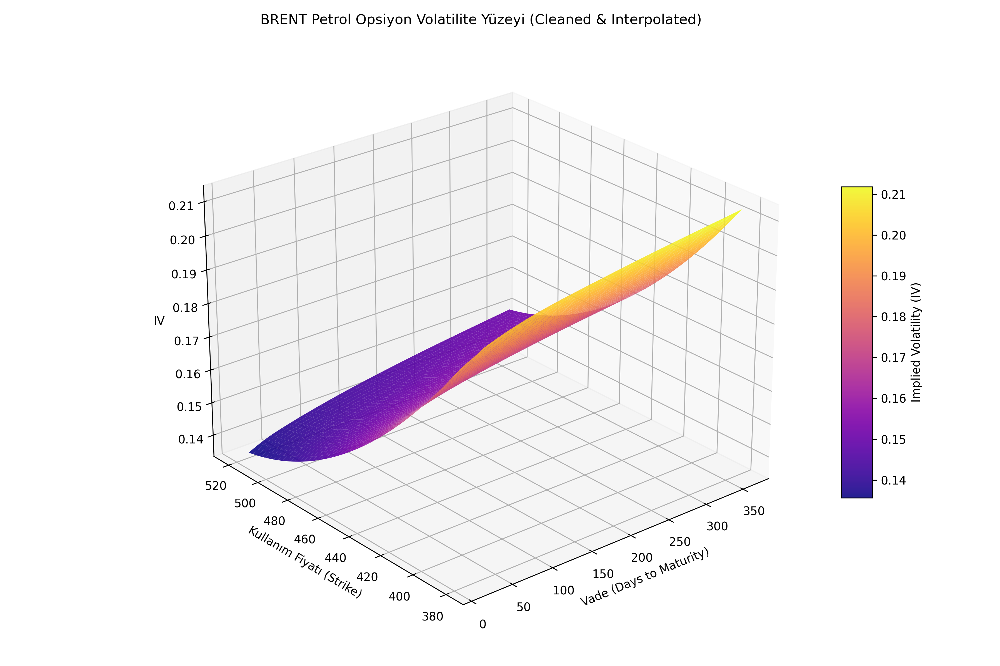

# 📈 Options Volatility Surface Cleaner & Interpolator

Bu proje, finansal piyasalardaki ham opsiyon verilerini (Option Chains) işleyen, gürültüden arındıran ve türev ürün fiyatlaması için kritik olan **pürüzsüz bir 3D Volatilite Yüzeyi** oluşturan bir Quant aracıdır.

## 🌟 Showcase (Vitrin) Özelliği
GitHub üzerinde bir projenin etkileyici durması için kodun temizliği kadar, verinin işlenme hikayesi de önemlidir. Bu proje:
- **Ham Veri:** Gerçek dünya hatalarını simüle eder.
- **Analitik Yaklaşım:** Z-Score ve Outlier tespiti gibi Quant metodolojilerini kullanır.
- **Matematiksel Derinlik:** `Cubic Interpolation` ile veri eksikliklerini giderir.
- **Görsel Kalite:** Matplotlib mplot3d ile profesyonel renderlar sunar.

## 🛠️ Nasıl Çalıştırılır?
Tüm süreci adım adım görmek ve grafikleri incelemek için projenin kalbi olan Notebook dosyasını açın:
👉 **[Volatility_Surface_Analysis.ipynb](./Options_Surface_Project/Volatility_Surface_Analysis.ipynb)**

## 📊 Çıktı Örneği
Proje sonunda elde edilen pürüzsüz IV yüzeyi, opsiyon Greklerinin (Delta, Gamma, Vega) doğru hesaplanması için temel teşkil eder.

